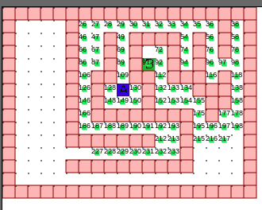

# Pathfinding

> Pathfinding library that implements A\* with Euclidean distance.
> On success it can return the full backtracked path or only the waypoints.

This library provides you with:

- path finding for a map represented by a matrix (1D / flat or 2D).
- path found as `int[]` that can be the **full path** array of tiles or only the **waypoints** tiles (where the direction changes).
- logic can run **in a loop** (step by step, e.g. only 30 times per second) or **continuous** (e.g. Webworker)
- hooks like `onInsertQueue(node)` on `onSuccess`.



### Install

```
npm install @serbanghita/pathfinding
```

### Usage

| Config option     | Type                     | Description                                                                   |
| ----------------- | ------------------------ | ----------------------------------------------------------------------------- |
| matrix2D          | `number[][]`             | A 2d matrix.                                                                  |
| matrix1D          | `number[]`               | A 1d matrix (flat array).                                                     |
| matrixWidth       | `number`                 | Matrix width, mandatory for `matrix1D`.                                       |
| matrixHeight      | `number`                 | Matrix height, mandatory for `matrix1D`.                                      |
| searchType        | `enum`                   | `AStarPathFindingSearchType.BY_STEP`, `AStarPathFindingSearchType.CONTINUOUS` |
| startCoordinates  | `{x: number, y: number}` | Starting point                                                                |
| finishCoordinates | `{x: number, y: number}` | End goal point                                                                |

#### STEP method

> Recommended for loops, batches (e.g. game loop)

```ts
const aStar = new AStarPathFinding({
  matrix2D: [
    [0, 1, 0, 0, 0],
    [0, 1, 0, 1, 0],
    [0, 0, 0, 1, 0],
  ],
  matrixTileSize: 1,
  searchType: AStarPathFindingSearchType.BY_STEP,
  startCoordinates: { x: 0, y: 0 },
  finishCoordinates: { x: 4, y: 2 },
});
// include the following in your loop() fn.
let result = aStar.search();
```

#### CONTINUOUS method

> Recommended for separate thread (e.g. Webworker)

```ts
const aStar = new AStarPathFinding({
  matrix2D: [
    [0, 1, 0, 0, 0],
    [0, 1, 0, 1, 0],
    [0, 0, 0, 1, 0],
  ],
  matrixTileSize: 1,
  searchType: AStarPathFindingSearchType.CONTINUOUS, // <--- This
  startCoordinates: { x: 0, y: 0 },
  finishCoordinates: { x: 4, y: 2 },
});
const result = aStar.search();
```
